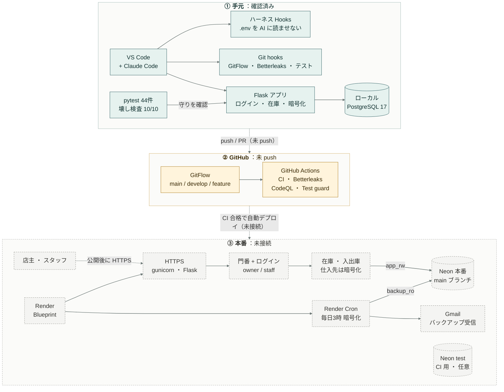

# 全体図（状態つき）

VS Code でこのファイルを開いて `Cmd + Shift + V` を押すと図になります（拡張 `bierner.markdown-mermaid`・アカウント不要）。

緑 = ローカルで実装・確認済み / 黄 = 設定ファイルあり・未実行 / 灰の点線枠 = 外部サービス未接続

```mermaid
---
config:
  markdownAutoWrap: false
  flowchart:
    wrappingWidth: 420
    nodeSpacing: 40
    rankSpacing: 55
  themeVariables:
    fontSize: 20px
---
flowchart TB
  %% 喫茶在庫の全体図（状態つき）。docs/ARCHITECTURE.md の「全体図」と同じ内容なので、直すときは両方そろえる
  %% 3段を縦に積み、段の中は左→右。段どうしは段そのものを矢印でつなぐ（中の向き LR を保つため）
  classDef done fill:#e6f2ef,stroke:#23565a,color:#10302f
  classDef ready fill:#fff4dc,stroke:#a8740f,color:#3a2a05
  classDef todo fill:#f4f4f2,stroke:#8a8a85,color:#33332f,stroke-dasharray:4 3

  subgraph L["`**① 手元** ：確認済み`"]
    direction LR
    VS["VS Code<br/>+ Claude Code"]
    HK["ハーネス Hooks<br/>.env を AI に読ませない"]
    GHK["Git hooks<br/>GitFlow ・ Betterleaks ・ テスト"]
    TST["pytest 44件<br/>壊し検査 10/10"]
    APP["Flask アプリ<br/>ログイン ・ 在庫 ・ 暗号化"]
    LDB[("ローカル<br/>PostgreSQL 17")]
    VS --> HK
    VS --> GHK
    VS --> APP --> LDB
    TST -->|守りを確認| APP
  end

  subgraph G["`**② GitHub** ：未 push`"]
    direction LR
    GF["GitFlow<br/>main / develop / feature"]
    ACT["GitHub Actions<br/>CI ・ Betterleaks<br/>CodeQL ・ Test guard"]
    GF --> ACT
  end

  subgraph P["`**③ 本番** ：未接続`"]
    direction LR
    USR["店主 ・ スタッフ"]
    BP["Render<br/>Blueprint"]
    WEB["HTTPS<br/>gunicorn ・ Flask"]
    AUTH["門番 + ログイン<br/>owner / staff"]
    INV["在庫 ・ 入出庫<br/>仕入先は暗号化"]
    NEON[("Neon 本番<br/>main ブランチ")]
    NT[("Neon test<br/>CI 用 ・ 任意")]
    CRON["Render Cron<br/>毎日3時 暗号化"]
    GM["Gmail<br/>バックアップ受信"]
    USR -. 公開後に HTTPS .-> WEB
    BP --> WEB --> AUTH --> INV -->|app_rw| NEON
    BP --> CRON -->|backup_ro| NEON
    CRON --> GM
  end

  L -. "push / PR（未 push）" .-> G
  G -. "CI 合格で自動デプロイ（未接続）" .-> P

  linkStyle default stroke:#6b7775,stroke-width:1.5px

  style L fill:#fbfbf9,stroke:#9fb8b4,color:#10302f
  style G fill:#fbfbf9,stroke:#d2b06a,color:#3a2a05
  style P fill:#fbfbf9,stroke:#a5a5a0,color:#33332f,stroke-dasharray:4 3

  class VS,HK,GHK,APP,LDB,TST done
  class GF,ACT ready
  class USR,BP,WEB,AUTH,INV,NEON,NT,CRON,GM todo
```
